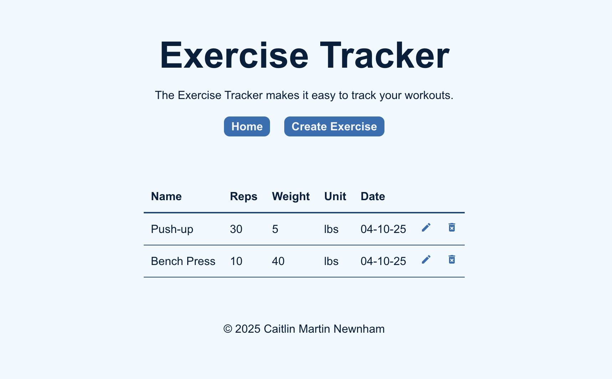

# 🏋️‍♀️ Exercise Tracker


The **Exercise Tracker** is a full-stack web application that helps users log and manage their workout routines. It allows users to create, view, update, and delete exercises with fields like name, reps, weight, weight unit (kgs/lbs), and date.

## 🌐 Live Demo

> Coming soon... 

## 📸 Screenshots



## 🧰 Tech Stack

### Frontend – `exercise_react`
- React
- React Router
- Vite
- CSS

### Backend – `exercise_rest`
- Express.js
- MongoDB (via Mongoose)
- dotenv
- express-async-handler

## 📂 Folder Structure

```
.
├── exercise_react/         # React frontend with routing and UI components
├── exercise_rest/          # Express backend with RESTful API
└── .gitignore              # Ignores node_modules, dist, etc.
```

## 🚀 Features

- 📝 Add a new exercise (name, reps, weight, unit, date)
- 📋 View a list of all exercises
- ✏️ Edit existing exercises
- 🗑️ Delete exercises
- ✅ Form validation (including regex for date validation for MM-DD-YY format)

## 📦 Installation

1. **Clone the repository**:

```bash
git clone https://github.com/helloiamcait/exercise-tracker.git
cd exercise-tracker
```

2. **Install dependencies** for both frontend and backend:

```bash
cd exercise_rest
npm install

cd ../exercise_react
npm install
```

## 🔧 Configuration

Create a `.env` file inside `exercise_rest/` with the following environment variables:

```env
PORT=3000
MONGODB_CONNECT_STRING=your-mongodb-connection-string
```

## 💻 Running the App Locally

### Start Backend Server

```bash
cd exercise_rest
npm start
```

### Start Frontend (in a separate terminal)

```bash
cd exercise_react
npm run dev
```

The app should now be running at:  
📍 `http://localhost:5173`  
API is available at:  
📍 `http://localhost:3000/exercises`

## 🧪 API Endpoints

| Method | Endpoint             | Description                  |
|--------|----------------------|------------------------------|
| GET    | `/exercises`         | Get all exercises            |
| GET    | `/exercises/:_id`    | Get one exercise by ID       |
| POST   | `/exercises`         | Create a new exercise        |
| PUT    | `/exercises/:_id`    | Update an exercise           |
| DELETE | `/exercises/:_id`    | Delete an exercise           |

All exercise objects have the structure:
```json
{
  "name": "Push-ups",
  "reps": 20,
  "weight": 0,
  "unit": "lbs",
  "date": "04-09-25"
}
```

## ⚠️ Validation Rules

- `name`: string, not empty
- `reps`: number > 0
- `weight`: number > 0
- `unit`: must be `"kgs"` or `"lbs"`
- `date`: string, format `MM-DD-YY`

## 📌 To-Do / Improvements

- Add user authentication
- Implement pagination or filtering
- Add graphs/stats (e.g., progress over time)
- Responsive design improvements

## 🧑‍💻 Author

**Caitlin Martin Newnham**  
© 2025
